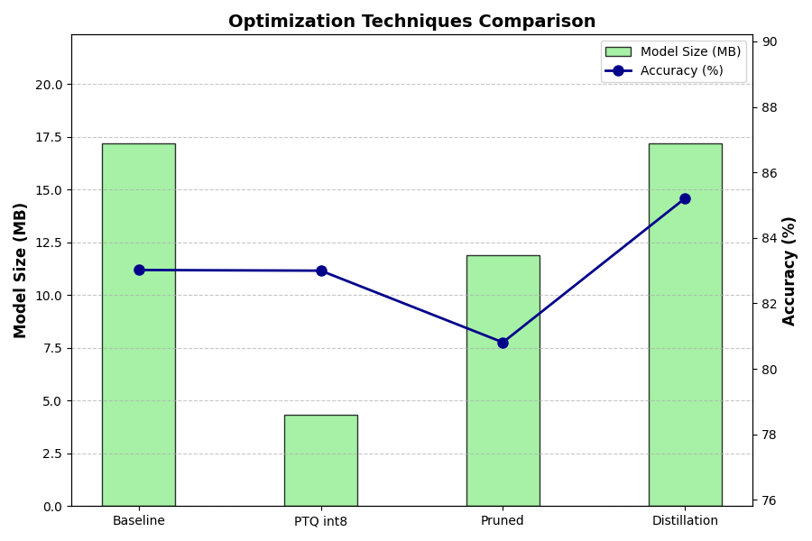
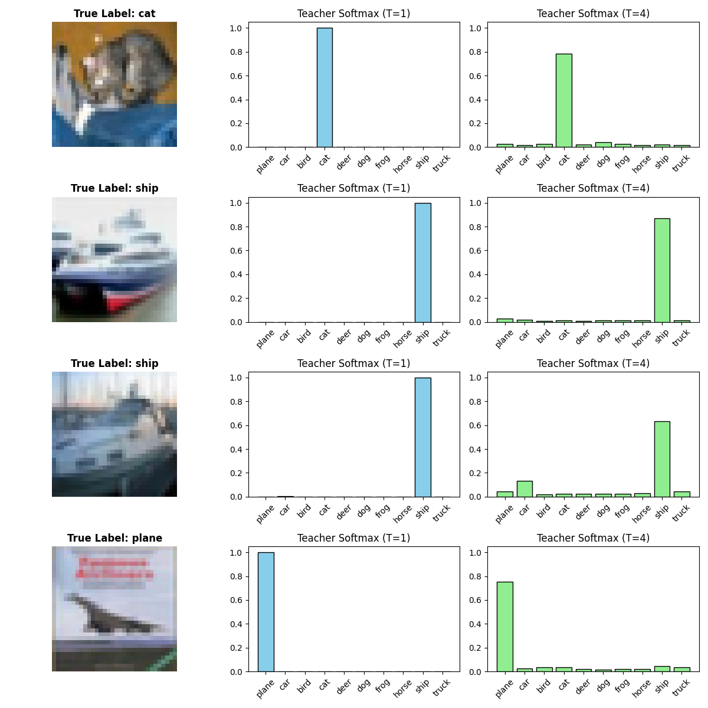

# Model Optimization for Deep Learning

A comprehensive PyTorch implementation and hardware performance analysis of deep learning model optimization techniques on the CIFAR-10 dataset. 

This repository goes beyond standard model training. It features a deep dive into compressing and accelerating an already-trained Convolutional Neural Network (CNN) using **Post-Training Quantization (PTQ)**, **Structured Pruning**, and **Knowledge Distillation (KD)**, demonstrating the strict trade-offs between model size, computational complexity, and inference latency.

## Table of Contents
- [Project Overview](#project-overview)
- [Key Features](#key-features)
- [Repository Structure](#repository-structure)
- [Installation & Setup](#installation--setup)
- [Usage](#usage)
- [Experimental Results](#experimental-results)
- [Performance Analysis & Insights](#performance-analysis--insights)
- [Advanced Experiments (Bonus)](#advanced-experiments-bonus)
- [Documentation](#documentation)

---

## Project Overview

While previous projects focused on designing architectures from scratch, this project shifts the paradigm toward optimizing an **already-trained baseline model**. 

The starting point is a custom `BasicCNN` equipped with Batch Normalization layers, which achieves an initial accuracy of ~83.02%. The goal is to systematically apply three distinct optimization techniques to reduce the memory footprint and FLOPs while recovering or even surpassing the original accuracy.

## Key Features

- **Post-Training Quantization (PTQ):** Utilizes `fbgemm` static quantization to fuse `Conv+BN+ReLU` layers and convert FP32 parameters to INT8 precision.
- **Layer-wise Structured Pruning:** Implements physical channel reduction by scoring filters via L1-norm, rebuilding cascade dimensions, and applying short fine-tuning.
- **Knowledge Distillation (KD):** Trains the CNN student supervised by the official **ResNet-50 (IMAGENET1K_V2)** teacher via combined KL Divergence and Cross-Entropy loss.
- **Hardware Profiling:** Benchmarks exact model size (MB), FLOPs, and CPU inference latency across all optimization stages.

## Repository Structure

```text
.
├── docs/
│   └── Model_Optimization_Techniques_Presentation.pdf    # Detailed project report and analysis
├── image/                                                # Training metrics and visualization screenshots
│   ├── optimization_comparison.png
│   ├── soft_labels_comparison.png
│   └── ...
├── model/                                                # Saved weights for best performing models (.pth)
├── src/
│   ├── cnn_pytorch.py                                    # Baseline model definitions
│   ├── optimize_pipeline.py                              # Main pipeline (PTQ, Pruning, KD benchmarking)
│   └── bonus_tasks.py                                    # Advanced Grid Search and Combine experiments
├── .gitignore
├── requirements.txt                                      # Python dependencies
└── README.md
```

## Installation & Setup

1. Clone this repository:
```bash
git clone https://github.com/Wzx0110/Model-Optimization-Techniques.git
cd Model-Optimization-Techniques
```

2. Create a virtual environment and install dependencies:
```bash
python -m venv venv
source venv/bin/activate  # On Windows use `venv\Scripts\activate`
pip install -r requirements.txt
```

## Usage

To run the complete optimization benchmarking pipeline, simply execute:

```bash
python src/optimize_pipeline.py
```
This script will:
- Load the pre-trained `BasicCNN` baseline.
- Apply PTQ int8 quantization.
- Perform structured pruning and 5-epoch fine-tuning.
- Train a Knowledge Distillation student for 30 epochs.
- Output a detailed hardware performance report and generate comparative charts.

To run the advanced grid search and soft labels visualization:
```bash
python src/bonus_tasks.py
```

## Experimental Results

The following metrics were recorded after executing the full pipeline. All models derive from the identical starting `BasicCNN` architecture.

| Model Variant | Validation Accuracy | Model Size | CPU Latency | FLOPs |
| :--- | :---: | :---: | :---: | :---: |
| **Float32 Baseline** | 83.02% | 17.18 MB | 0.55 ms | 0.0145 G |
| **PTQ int8** | 83.00% | **4.32 MB** *(~75%↓)* | 0.65 ms | N/A |
| **Pruned Model (30%)** | 81.13% | 11.88 MB | 0.64 ms | **0.0081 G** *(~44%↓)* |
| **Distilled Student** | **85.00%** | 17.18 MB | **0.55 ms** | 0.0145 G |

### Optimization Techniques Comparison


## Performance Analysis & Insights

Comparing the results yields several critical hardware and theoretical insights:

1. **Quantization Efficiency:** PTQ achieved a **~75% reduction** in model size while maintaining near-lossless accuracy (only a 0.02% drop). This proves that 8-bit integer precision provides more than sufficient representational capacity for CIFAR-10 features.
2. **Pruning vs. FLOPs:** Structured pruning effectively removed redundant physical filters, dropping the computational cost from 0.0145 GFLOPs to 0.0081 GFLOPs. Although initial accuracy dropped due to the information bottleneck, fine-tuning smoothly recovered the performance to a highly usable state (81.13%).
3. **The Power of Distillation:** The Distilled Student retained the exact architectural footprint of the baseline but achieved an accuracy boost of **+1.98%**. This demonstrates that soft targets successfully transfer "Dark Knowledge" (inter-class similarities) without introducing any physical overhead.

## Advanced Experiments (Bonus)

To push the boundaries of model optimization, we implemented three additional experiments:

1. **Extreme Compression (Pruning + Quantization):**
   By applying PTQ to the already-pruned model, the overall size collapsed to just **2.99 MB** while maintaining a solid accuracy of **79.76%**.
2. **KD Hyperparameter Grid Search:**
   We evaluated Temperature ($T \in \{2,4,8\}$) and Soft Loss Weight ($\alpha \in \{0.7,0.9\}$) over a 5-epoch early convergence test. The optimal combination was **$T=4,\alpha=0.7$**, achieving the fastest learning curve with a peak accuracy of **76.97%**.
3. **Soft Labels Visualization:**
   
   > **Observation:** As $T$ increases from 1 to 4, the output distribution smooths out. This amplifies the probabilities of incorrect but structurally similar classes, which is the core mechanism that helps the student network generalize better than one-hot labels.

## Documentation
For a complete walkthrough of the implementation, detailed methodology, and comprehensive analysis, please refer to the final project report:
[**Model_Optimization_Techniques_Presentation.pdf**](./docs/Model_Optimization_Techniques_Presentation.pdf)
